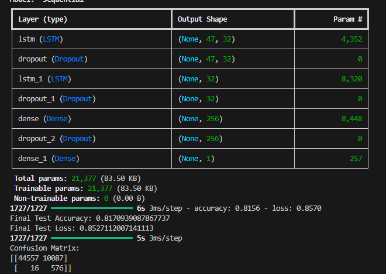

# Intelligent Cloud Security Threat Detection Model

## Project Overview
This project is focused on building and evaluating machine learning models for detecting various types of security threats in cloud environments. My primary goal is to enhance cloud security by leveraging advanced data-driven techniques to identify and classify malicious activities.

## Dataset
I used the **CICIDS2017** dataset, a comprehensive intrusion detection dataset that includes a wide range of network traffic scenarios. It contains labeled data for multiple threat types, such as:
- Bot
- Brute Force
- DDoS
- DoS
- Infiltration
- PortScan
- Web Attacks
- Normal traffic

## Project Structure

Below is a visual representation of the project folder hierarchy, with explanations for each main part:

```
Intelligent-Cloud-Security-Threat-Detection-Model/
│
├── autokeras_model/         # AutoKeras model trials and best models for each threat type
│   ├── Bot/
│   ├── BruteForce/
│   ├── DDOS/
│   ├── Dos/
│   ├── Infilteration/
│   ├── PortScan/
│   └── WebAttacks/
│
├── cnn_trials/              # CNN model trials for each threat type
│   ├── BruteForce_CNN/
│   ├── DDOS_CNN/
│   ├── DoS_CNN/
│   ├── Infiltration_CNN/
│   ├── PortScan_CNN/
│   └── WebAttacks_CNN/
│
├── LSTN_Trials/             # LSTM model trials for each threat type
│   ├── Bot_LSTM/
│   ├── BruteForce_LSTM/
│   ├── DDoS_LSTM/
│   ├── Dos_LSTM/
│   ├── Infiltration_LSTM/
│   ├── portscan_lstm/
│   └── WebAttacks_LSTM/
│
├── Merged datasets/         # Scripts for merging and preprocessing datasets (not fully implemented yet, but planned for future integration; results may be available soon)
│   └── DTRF_Merged.py
│
├── Models/                  # Python scripts for model architectures and utilities
│   ├── AutoKeras.py
│   ├── CNN.py
│   ├── DataInfo.py
│   ├── DecisionTree and Random Forest.py
│   ├── GPU_Check.py
│   └── LSTM.py
│
├── *.csv                    # Raw data files for each threat type and normal traffic
│   ├── Bot.csv
│   ├── BruteForce.csv
│   ├── DDOS.csv
│   ├── DoS.csv
│   ├── Infilteration.csv
│   ├── Normal.csv
│   ├── PortScan.csv
│   └── WebAttacks.csv
│
└── README.md                # Project documentation
```

**Explanation:**
- `autokeras_model/`, `cnn_trials/`, `LSTN_Trials/`: Store model training results and best models for each threat type using different architectures (AutoKeras, CNN, LSTM).
- `Merged datasets/`: Contains scripts for merging and preprocessing the raw datasets. This part is not fully implemented yet, but it is in the plan and results may be available soon.
- `Models/`: Contains Python scripts for building, training, and evaluating different machine learning models.
- `*.csv`: Raw data files for each threat type and normal traffic, sourced from the CICIDS2017 dataset.
- `README.md`: Main project documentation.

## Frameworks and Technologies Used
- **Python**: Main programming language
- **TensorFlow & Keras**: Deep learning frameworks for CNN and LSTM models
- **AutoKeras**: Automated machine learning for model selection and tuning
- **Scikit-learn**: Traditional machine learning models (Decision Tree, Random Forest)
- **Pandas & NumPy**: Data manipulation and analysis

## Implemented Model Types
- **AutoKeras Models**: Automated neural architecture search for each threat type
- **Convolutional Neural Networks (CNNs)**: For feature extraction and classification
- **Long Short-Term Memory Networks (LSTMs)**: For sequential data modeling
- **Decision Tree & Random Forest**: Classical machine learning baselines

## Model Evaluation

Every model I implemented was tested using the following evaluation metrics:
- **Confusion Matrix**: To visualize the performance of the classification models and understand the distribution of true/false positives and negatives.
- **Precision**: To measure the accuracy of positive predictions for each threat type.
- **Recall**: To assess the ability of the model to find all relevant cases (threats).
- **F1 Score**: To provide a balance between precision and recall for each class.
- **Test Accuracy**: To evaluate the overall correctness of the model's predictions on unseen data.
- **Loss**: For neural network models (such as CNN, LSTM, and AutoKeras), I also tracked the loss value during training and testing to monitor model convergence and performance.

These metrics helped me compare the effectiveness of different models and select the best-performing ones for each threat type.

## Results (Sample: Only Bot Results Shown)

Before presenting the model results, I will first explain the dataset editing and preparation steps performed prior to training. This ensures the data is clean, balanced, and suitable for building effective models.

**Data Rows (Bot)**


- The first part of this image shows the data before any data cleaning, dropping NA values, replacing inf/-inf values, or filling NaN data. The second part displays the training data after performing data cleaning and resampling both classes (normal and bot/threat (1)). The third part presents the test data after training the model; these are the rows used to generate the evaluation results.

**Data Head (Bot)**


- This image is an example of how the data looks, including the features used for training and evaluation.

After making these dataset adjustments, I proceeded to train and evaluate the models. The following images show the results after applying the data cleaning and preparation steps described above.

**AutoKeras Model (Bot)**


**Decision Tree & Random Forest Models (Bot)**


**Convolutional Neural Network (CNN) Model (Bot)**


**Long Short-Term Memory (LSTM) Model (Bot)**



## Dataset Editing and Preparation

In this section, I will discuss the dataset editing and preparation steps performed before training and evaluating the models.

## Future Work
- **Automated Response Triggers**: I aim to integrate routines to automatically trigger cloud activity shutdown or mitigation procedures upon detection of suspicious activity.

## Additional Notes
- A **multi-class classification model** is implemented in the `Merged datasets/DecisionTree_merged.py` script, allowing classification across all threat types in a unified approach.
- This repository presents the full codebase for all experiments, models, and data processing steps described above.
- Detailed explanations of all models and their development steps are provided in the attached PDF files: `thesis` (my thesis) and `multiclass model` (steps for the additional multi-class model).

---
For more details, refer to the code and scripts in the respective folders.

